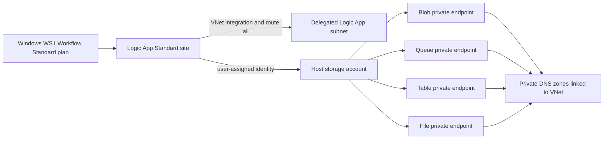

# Logic App Standard infrastructure baseline

Every Logic App in this workshop must use the private-networked Logic App
Standard pattern from the following source implementations:

- [Bicep reference](https://github.com/scallighan/logic-app-doc-processing/tree/main/bicep)
- [Terraform reference](https://github.com/scallighan/logic-app-doc-processing/tree/main/terraform)

Read the matching reference implementation before generating or changing a lab
deployment. The reference repository is the source of truth for the resources,
settings, dependencies, and managed-identity wiring in the scope below. Do not
replace this pattern with a Consumption Logic App, a public host-storage
connection string, or a simplified Standard deployment.

## Required resource graph

Each lab has one shared Logic App hosting foundation:

The lab-specific Cosmos DB, Service Bus, APIM, Static Web App, and observability
resources extend this graph; they do not replace or weaken it.

## Reference-matched requirements

| Area | Required implementation |
|---|---|
| Virtual network | Use the reference `172.22.0.0/16` address space and its four `/24` subnets: default, Container Apps environment, private endpoints, and Logic App integration. Disable default outbound access on each subnet. Preserve the `Microsoft.App/environments` and `Microsoft.Web/serverFarms` delegations from the reference. Parameterize the address prefixes only if a lab must fit an existing network. |
| Host storage | Use a `StorageV2`, `Standard_LRS`, Hot account with HTTPS-only traffic, TLS 1.2 minimum, and blob public access disabled. Never use an account key or connection string. |
| Storage private connectivity | Create separate blob, queue, table, and file private endpoints in the private-endpoint subnet. Create the corresponding `privatelink` private DNS zones, link them to the VNet, and attach each endpoint to its zone with a private DNS zone group. |
| Host-storage identity | Create a user-assigned managed identity and grant it Storage Blob Data Contributor, Storage Queue Data Contributor, and Storage Table Data Contributor on the host storage account. |
| App Service plan | Use a Windows `WS1` Workflow Standard plan. This and the private endpoints are cost-bearing resources and must be identified before deployment. |
| Logic App | Deploy `Microsoft.Web/sites` as `functionapp,workflowapp` with both system-assigned and host-storage user-assigned identities. Attach it to the delegated Logic App subnet and route all outbound traffic through the VNet. |
| Host settings | Preserve the reference Functions v4, .NET worker, Workflows extension bundle, `APP_KIND=workflowApp`, in-process .NET 8, and PowerShell settings. Configure `AzureWebJobsStorage` with the user-assigned identity resource ID and blob, queue, and table service URIs. Lab-specific settings may be added but must not replace these host settings. |
| Dependencies | Do not create the Logic App site until the plan, host-storage RBAC assignments, and all four storage private endpoints are ready. |

Use the current stable Azure API versions and the repository's pinned Terraform
provider constraints while preserving the reference behavior. If the Bicep and
Terraform reference files differ, report the difference and keep the lab tracks
behaviorally equivalent rather than silently choosing a third design.

Private endpoints do not by themselves prove that public access is disabled.
Review the reference account properties and deployment preview explicitly; do
not invent or weaken a network-access setting.

## Identity boundaries

The user-assigned identity exists for Logic App host-storage access. Keep each
Logic App's system-assigned identity for lab workload access:

- Lab 1 grants its Logic App system identity only the required Cosmos DB
  data-plane access.
- Lab 2 grants each Logic App system identity access only to its assigned
  Service Bus subscription.

Do not replace either identity boundary with shared keys or broaden the
user-assigned identity to all lab data-plane resources.

## Lab 2 shared foundation

Lab 2 creates one VNet, one host storage account, four storage private
endpoints, one host-storage user-assigned identity, and one WS1 plan. Audit,
fulfillment, and notification remain three separate Logic App Standard sites
on that shared plan. Each site:

- attaches to the same delegated Logic App subnet;
- uses the shared host-storage identity and managed-identity host settings;
- has its own system-assigned identity and Service Bus RBAC assignment; and
- remains independently deployable and bound to exactly one subscription.

The shared hosting foundation does not change peek-lock, completion, retry, or
dead-letter requirements.
