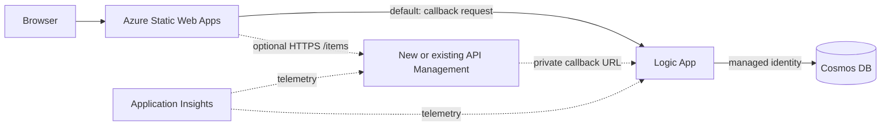

# Lab 1: CRUD integration

Build a small item-management website backed by a Logic App and Azure Cosmos
DB. Use the no-cost direct mode by default, or optionally place the API in a new
or existing Azure API Management instance.

**Time:** 90 minutes

## Learning objectives

- Ground Copilot in an OpenAPI contract and repository instructions.
- Generate equivalent Bicep or Terraform in small, reviewable checkpoints.
- Compare direct access with new and existing API Management options.
- Grant Cosmos DB access through managed identity and least-privilege RBAC.
- Use Copilot to diagnose a deployment or request from exact tool output.

## Architecture



The workshop uses one HTTP-triggered Logic App with explicit operation handling.
[`contracts/openapi.yaml`](contracts/openapi.yaml) defines the public REST
contract when APIM is enabled. The `items` Cosmos container uses `/id` as its
partition key.

The workflow is a private-networked Logic App Standard site and must follow
[`docs/logic-app-standard-baseline.md`](../../docs/logic-app-standard-baseline.md).
Its user-assigned identity accesses host storage; its system-assigned identity
accesses Cosmos DB.

All modes send one canonical backend request shape containing the OpenAPI
`operationId`, optional item ID, body, and correlation ID. APIM policies perform
that mapping in APIM modes; the starter app performs it in direct mode. The
Logic App switches on `operationId`.

## API Management modes

Use one explicit IaC setting in both tracks:

| Mode | Behavior |
|---|---|
| `none` | **Default.** Creates no APIM resources; the browser calls the temporary Logic App callback URL. |
| `new` | Creates a workshop APIM instance plus the API, operations, and API-scoped policies. |
| `existing` | Requires an existing APIM name and resource group in the current subscription; creates only workshop-owned child resources. |

Use these consistent inputs:

| Bicep | Terraform | Requirement |
|---|---|---|
| `apiManagementMode` | `api_management_mode` | `none`, `new`, or `existing`; defaults to `none` |
| `existingApimName` | `existing_apim_name` | Required only for `existing` |
| `existingApimResourceGroupName` | `existing_apim_resource_group_name` | Required only for `existing` |

Direct mode is intentionally a low-cost learning path, not a production
pattern. The callback URL authorizes invocation and is visible to the browser.
Do not commit, log, or share it; do not persist it in browser storage; delete the
workshop workflow afterward. The workflow must handle CORS preflight and return
an `Access-Control-Allow-Origin` value restricted to the Static Web App origin.

## Target resource graph

Both IaC tracks must create behaviorally equivalent resources:

| Resource | Workshop requirement |
|---|---|
| Resource group | Lab-specific tags and chosen location |
| Cosmos DB account | Serverless capacity, local authentication disabled |
| SQL database/container | `workshop` / `items`, partition key `/id` |
| Virtual network | Reference four-subnet layout with delegated Logic App and private-endpoint subnets |
| Host storage | Keyless Standard_LRS account with blob, queue, table, and file private endpoints and private DNS |
| App Service plan | Windows WS1 Workflow Standard; cost-bearing |
| Logic App | Standard site with dual identities, VNet route-all, and HTTP request trigger |
| Cosmos RBAC | Logic App can read and write data only at the needed scope |
| API Management | Optional; none, a low-cost new instance, or an existing instance |
| APIM policy | APIM modes only; maps operations without exposing the callback URL |
| Static Web App | Free SKU hosting the starter UI |
| Application Insights | Basic request and workflow observability |

Do not store a callback URL in Git, a Terraform output, or a Bicep output. In
direct mode, retrieve it only for the current exercise and paste it into the
starter UI. If IaC retrieves it to configure APIM, keep the value inside the
deployment expression or mark it sensitive.

## Choose a track

Use one track for implementation:

- **Bicep:** invoke
  [`.github/prompts/01-crud-bicep.prompt.md`](../../.github/prompts/01-crud-bicep.prompt.md)
  and work in `labs/01-crud-integration/iac/bicep/`.
- **Terraform:** invoke
  [`.github/prompts/01-crud-terraform.prompt.md`](../../.github/prompts/01-crud-terraform.prompt.md)
  and work in `labs/01-crud-integration/iac/terraform/`.

Create your selected directory when Copilot begins the first checkpoint. Keep
local parameter values and Terraform state untracked.

## Checkpoint 1: contract and resource graph

1. Read the OpenAPI contract and inspect the starter app.
2. Ask Copilot to summarize every request, response, and required Azure
   resource. Correct its summary before allowing edits.
3. Ask Copilot to scaffold only providers/metadata, parameters or variables,
   naming, tags, and the resource group.
4. Validate without deploying.

**Bicep**

```bash
az bicep format --file labs/01-crud-integration/iac/bicep/main.bicep
az bicep build --file labs/01-crud-integration/iac/bicep/main.bicep
az deployment sub what-if \
  --location eastus2 \
  --template-file labs/01-crud-integration/iac/bicep/main.bicep \
  --parameters prefix="<your-prefix>" location="eastus2" \
   apiManagementMode="none"
```

**Terraform**

```bash
terraform -chdir=labs/01-crud-integration/iac/terraform init
terraform -chdir=labs/01-crud-integration/iac/terraform fmt -check
terraform -chdir=labs/01-crud-integration/iac/terraform validate
terraform -chdir=labs/01-crud-integration/iac/terraform plan \
  -var="prefix=<your-prefix>" -var="location=eastus2" \
  -var="api_management_mode=none"
```

**Checkpoint:** the preview contains one new resource group with no secrets in
parameters, variables, or outputs.

## Checkpoint 2: data and workflow

Ask Copilot to add only the reference Logic App Standard hosting foundation,
Cosmos DB, the workflow, identities, and RBAC.

Require it to explain:

- why `/id` works as both identifier and partition key for this lab;
- which Cosmos DB data-plane role is assigned and at what scope;
- how the workflow distinguishes list, get, create, update, and delete;
- how it maps not-found, validation, and unexpected errors to HTTP statuses;
- how retry behavior avoids accidentally repeating writes.

Deploy after the preview is understood:

```bash
# Bicep
az deployment sub create \
  --name "crud-<your-prefix>" \
  --location eastus2 \
  --template-file labs/01-crud-integration/iac/bicep/main.bicep \
  --parameters prefix="<your-prefix>" location="eastus2" \
    apiManagementMode="none"

# Terraform
terraform -chdir=labs/01-crud-integration/iac/terraform apply \
  -var="prefix=<your-prefix>" -var="location=eastus2" \
  -var="api_management_mode=none"
```

**Checkpoint:** Azure shows a system-assigned workflow identity and a Cosmos
data-plane role assignment. No account key appears in workflow parameters.

## Checkpoint 3: choose the API path

### Option A: direct mode (default)

Keep `apiManagementMode` or `api_management_mode` set to `none`. Ask Copilot to
add CORS preflight handling and restricted response headers to the workflow.
Retrieve the callback URL for the current session without writing it to a file,
repository output, or shell history. Use the Azure portal if your shell history
is retained.

In the starter UI choose **Direct Logic App** and paste the callback URL. The
app converts REST-style UI actions to the canonical backend request.

**Checkpoint:** create, list, get, update, and delete work directly, and the
callback URL is not persisted in browser local storage.

### Option B: new or existing APIM

Set the mode to `new`, or set it to `existing` and supply the existing instance:

```bash
# Bicep example
--parameters apiManagementMode="existing" \
  existingApimName="<apim-name>" \
  existingApimResourceGroupName="<apim-resource-group>"

# Terraform example
-var="api_management_mode=existing" \
-var="existing_apim_name=<apim-name>" \
-var="existing_apim_resource_group_name=<apim-resource-group>"
```

Ask Copilot to import `contracts/openapi.yaml` into API Management, map every
operation to the canonical backend request shape described above, and apply:

- a correlation ID when the client did not provide one;
- JSON content-type enforcement for writes;
- a small workshop rate limit;
- removal of backend-only headers from responses; and
- CORS restricted to the deployed Static Web App hostname.

Review generated policy XML carefully. Confirm that public responses and IaC
outputs cannot reveal the workflow callback URL. For existing APIM, confirm the
preview does not replace the service or modify service-wide configuration.

**Checkpoint:** the APIM test console can create, list, get, update, and delete
an item with the statuses defined in the contract.

## Checkpoint 4: frontend and end-to-end test

Deploy the files under `app/` to Static Web Apps. Choose the matching connection
mode in the UI. Never hard-code a callback URL or subscription key.

Ask Copilot to generate `curl` tests from the OpenAPI contract. At minimum,
verify:

```bash
api_base="https://<apim-name>.azure-api.net/workshop" # APIM modes
item_id="$(uuidgen | tr '[:upper:]' '[:lower:]')"

curl --fail-with-body -X POST "$api_base/items" \
  -H 'Content-Type: application/json' \
  -d "{\"id\":\"$item_id\",\"name\":\"Copilot workshop\",\"status\":\"new\"}"
curl --fail-with-body "$api_base/items/$item_id"
curl --fail-with-body -X PUT "$api_base/items/$item_id" \
  -H 'Content-Type: application/json' \
  -d '{"name":"Copilot workshop","status":"complete"}'
curl --fail-with-body -X DELETE "$api_base/items/$item_id"
```

For direct mode, ask Copilot to generate equivalent canonical POST requests
without saving the callback URL in a script. Then use the browser UI and inspect
the correlated Logic App telemetry. In APIM modes, inspect both APIM and Logic
App telemetry.

## Copilot review challenge

Invoke
[`review-iac-parity.prompt.md`](../../.github/prompts/review-iac-parity.prompt.md)
with someone using the other track. Resolve behavioral differences, not cosmetic
syntax differences.

## Cleanup

Preview cleanup before approving it:

```bash
# Bicep-created resource group
az group delete --name "<resource-group-name>" --yes --no-wait

# Terraform
terraform -chdir=labs/01-crud-integration/iac/terraform destroy \
  -var="prefix=<your-prefix>" -var="location=eastus2" \
  -var="api_management_mode=<mode>"
```

In existing APIM mode, confirm cleanup removes only the workshop API and its
policies, never the APIM instance. Confirm the workshop resource group is
deleted before moving to another subscription.

## Stretch goals

- Switch from direct mode to an existing APIM without recreating the backend.
- Add optimistic concurrency using an ETag.
- Generate contract tests and run them in GitHub Actions.
- Compare the workshop design with the private-network patterns in the
  [reference project](https://github.com/scallighan/logic-app-doc-processing).
