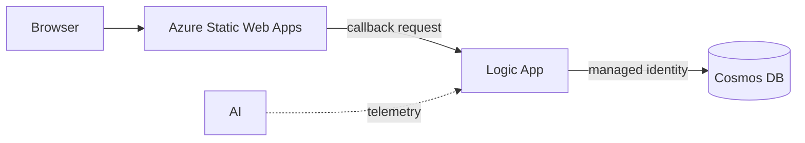

# Lab 1: CRUD integration

Build a small item-management website backed by a Logic App and Azure Cosmos
DB. The learner path connects the website directly to the workflow.

**Time:** 90 minutes

## Learning objectives

- Ground Copilot in an OpenAPI contract and repository instructions.
- Generate equivalent Bicep or Terraform through small, reviewable tasks.
- Grant Cosmos DB access through managed identity and least-privilege RBAC.
- Use Copilot to diagnose a deployment or request from exact tool output.

## Architecture



The workshop uses one HTTP-triggered Logic App with explicit operation handling.
[`contracts/openapi.yaml`](contracts/openapi.yaml) defines the operations and
response contract. The `items` Cosmos container uses `/id` as its partition
key.

The workflow is a private-networked Logic App Standard site and must follow
[`docs/logic-app-standard-baseline.md`](../../docs/logic-app-standard-baseline.md).
Its user-assigned identity accesses host storage; its system-assigned identity
accesses Cosmos DB.

The starter app sends one canonical request shape containing the OpenAPI
`operationId`, optional item ID, body, and correlation ID. The Logic App
switches on `operationId`.

The callback URL authorizes invocation and is visible to the browser for this
exercise. Do not commit, log, or share it; do not persist it in browser storage;
delete the workshop workflow afterward. The workflow must handle CORS preflight
and allow only the Static Web App origin.

## Implementation reference

Read [`implementation-requirements.md`](implementation-requirements.md) before
starting. It defines the target resource graph, identity boundaries, API
Management modes, workflow behavior, and secret-handling requirements for both
IaC tracks. The task prompts below intentionally describe outcomes rather than
repeat those guardrails.

## Choose a track

Use one track for implementation:

- **Bicep:** invoke
  [`.github/prompts/01-crud-bicep.prompt.md`](../../.github/prompts/01-crud-bicep.prompt.md)
  and work in `labs/01-crud-integration/iac/bicep/`.
- **Terraform:** invoke
  [`.github/prompts/01-crud-terraform.prompt.md`](../../.github/prompts/01-crud-terraform.prompt.md)
  and work in `labs/01-crud-integration/iac/terraform/`.

### Load the track context

The prompt file loads the selected track and mandatory references. The text
after the prompt name is the actual request. Start from the repository root so
Copilot can resolve every relative path.

**VS Code Copilot Chat**

1. Open this repository as the VS Code workspace.
2. Open Copilot Chat and select **Agent** mode.
3. Enter the prompt file name followed by the first task:

   ```text
   /01-crud-terraform Create the Terraform deployment foundation for Lab 1.
   Add only provider constraints, variables, naming, tags, and the resource
   group. Before editing, summarize the proposed files and resource graph,
   then wait for my approval.
   ```

4. Select the workspace prompt when it appears in autocomplete, then send the
   message.

**GitHub Copilot CLI**

1. In a terminal, change to the repository root and start Copilot:

   ```bash
   cd level-up-azure-integration-services
   copilot
   ```

2. At the interactive Copilot prompt, mention the file with `@`:

   ```text
   @.github/prompts/01-crud-terraform.prompt.md Create the Terraform deployment
   foundation for Lab 1. Add only provider constraints, variables, naming,
   tags, and the resource group. Before editing, summarize the proposed files
   and resource graph, then wait for my approval.
   ```

   Typing `@` opens file autocomplete; select the Terraform prompt rather than
   entering the text as a shell command.

The same process works for Bicep by using `/01-crud-bicep` in VS Code or
mentioning `@.github/prompts/01-crud-bicep.prompt.md` in Copilot CLI. See
[Invoking workshop prompt files](../../docs/copilot-working-agreement.md#invoking-workshop-prompt-files)
for the reusable pattern.

Create your selected directory when Copilot begins the first task. Keep local
parameter values and Terraform state untracked.

## Task 1: define the deployment foundation

**Outcome:** establish the contract and an independently valid deployment
foundation without creating application resources.

**Prompt Copilot**

```text
Read the OpenAPI contract and inspect the starter app. Summarize every request,
response, and required Azure resource.

Then create the deployment foundation for my selected IaC track. Add only
provider or template metadata, parameters or variables, deterministic naming,
required tags, and the resource group. Do not add networking, storage,
Cosmos DB, Logic Apps, Static Web Apps, or API Management.

Before editing, summarize the proposed files, resource graph, non-secret
outputs, and validation commands. Wait for my approval.
```

**Review before approving:** the proposed resource graph contains only the
resource group. Correct any contract, naming, identity, or output drift before
allowing edits.

**Validate**

**Bicep**

```bash
az bicep format --file labs/01-crud-integration/iac/bicep/main.bicep
az bicep build --file labs/01-crud-integration/iac/bicep/main.bicep
az deployment sub what-if \
  --location eastus2 \
  --template-file labs/01-crud-integration/iac/bicep/main.bicep \
  --parameters prefix="<your-prefix>" location="eastus2" \
   apiManagementMode="none"
```

**Terraform**

```bash
terraform -chdir=labs/01-crud-integration/iac/terraform init
terraform -chdir=labs/01-crud-integration/iac/terraform fmt -check
terraform -chdir=labs/01-crud-integration/iac/terraform validate
terraform -chdir=labs/01-crud-integration/iac/terraform plan \
  -var="prefix=<your-prefix>" -var="location=eastus2" \
  -var="api_management_mode=none"
```

**Done when:** the preview contains one new resource group with no secrets in
parameters, variables, or outputs.

## Task 2: add the data and workflow path

**Outcome:** deploy the private Logic App Standard hosting foundation, Cosmos
DB, workflow, identities, and least-privilege RBAC.

**Prompt Copilot**

```text
Add the private Logic App Standard hosting foundation and Cosmos DB integration
to the CRUD deployment. Include only the baseline hosting resources, Cosmos DB,
the workflow, identities, RBAC, and observability required for this request.
Do not add Static Web Apps or API Management.

Before editing, explain the resource graph and identity flow; why /id works as
the identifier and partition key; the Cosmos data-plane role and scope; how the
workflow routes each operationId; the HTTP error mapping; write retry behavior;
cost-bearing resources; and the validation commands. Wait for my approval.
```

**Review before approving:** confirm that the complete private Standard
baseline is present, the user-assigned identity is limited to host storage, the
system-assigned identity accesses Cosmos DB, and no keys or callback URLs are
outputs.

**Deploy after reviewing the preview**

```bash
# Bicep
az deployment sub create \
  --name "crud-<your-prefix>" \
  --location eastus2 \
  --template-file labs/01-crud-integration/iac/bicep/main.bicep \
  --parameters prefix="<your-prefix>" location="eastus2" \
    apiManagementMode="none"

# Terraform
terraform -chdir=labs/01-crud-integration/iac/terraform apply \
  -var="prefix=<your-prefix>" -var="location=eastus2" \
  -var="api_management_mode=none"
```

**Done when:** Azure shows a system-assigned workflow identity and a Cosmos
data-plane role assignment, and no account key appears in workflow parameters.

## Task 3: connect the frontend

**Outcome:** deploy the Static Web App and allow it to call the workflow
directly without persisting its callback URL.

**Prompt Copilot**

```text
Prepare the direct frontend path with API Management mode still set to none.
Add the Free-tier Static Web App, CORS preflight handling, and response headers
restricted to the deployed Static Web App origin.

Before editing, explain the resource and request flow, exact CORS behavior,
files that will change, non-secret outputs, and how to test every OpenAPI
operation. Do not retrieve, output, commit, log, or persist a Logic App callback
URL. Wait for my approval.
```

**Review before approving:** verify that the workflow allows only the intended
origin and that the callback URL is absent from source, outputs, and local
configuration.

Retrieve the callback URL for the current session without writing it to a file,
repository output, or shell history. Use the Azure portal if shell history is
retained.

In the starter UI choose **Direct Logic App** and paste the callback URL. The
app converts REST-style UI actions to the canonical backend request.

**Done when:** create, list, get, update, and delete work directly, and the
callback URL is not persisted in browser local storage.

## Task 4: deploy and test the frontend

Deploy the files under `app/` to Static Web Apps. In the UI, choose
**Direct Logic App** and paste the callback URL for this session. Never
hard-code it or save it in browser storage.

**Prompt Copilot**

```text
Create an end-to-end test plan for the deployed CRUD application using the
committed OpenAPI contract. Include create, list, get, update, delete,
validation, not-found, and correlation checks. Do not place the callback URL or
full sensitive payloads in commands, files, logs, or telemetry.
```

Create, list, get, update, and delete an item in the browser. Confirm each
result matches the OpenAPI contract, then inspect the correlated Logic App
telemetry.

**Done when:** every operation returns its contracted status and body, the
correlation ID is visible in telemetry, and no callback URL was persisted.

## Copilot review challenge

Invoke
[`review-iac-parity.prompt.md`](../../.github/prompts/review-iac-parity.prompt.md)
with someone using the other track. Resolve behavioral differences, not cosmetic
syntax differences.

## Cleanup

Preview cleanup before approving it:

```bash
# Bicep-created resource group
az group delete --name "<resource-group-name>" --yes --no-wait

# Terraform
terraform -chdir=labs/01-crud-integration/iac/terraform destroy \
  -var="prefix=<your-prefix>" -var="location=eastus2" \
  -var="api_management_mode=none"
```

Confirm the workshop resource group is deleted before moving to another
subscription.

## Stretch goals

- Add optimistic concurrency using an ETag.
- Generate contract tests and run them in GitHub Actions.
- Compare the workshop design with the private-network patterns in the
  [reference project](https://github.com/scallighan/logic-app-doc-processing).
