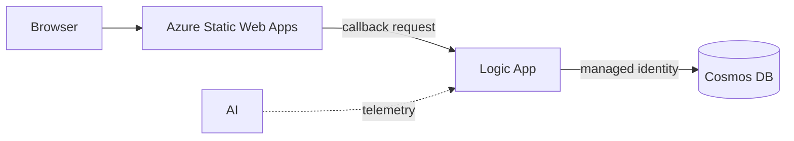

# Lab 1: CRUD integration

Build a small item-management website backed by a Logic App and Azure Cosmos
DB. The learner path connects the website directly to the workflow.

**Time:** 90 minutes

## Learning objectives

- Ground Copilot in an OpenAPI contract and repository instructions.
- Generate equivalent Bicep or Terraform through small, reviewable tasks.
- Grant Cosmos DB access through managed identity and least-privilege RBAC.
- Use Copilot to diagnose a deployment or request from exact tool output.

## Architecture



The workshop uses one HTTP-triggered Logic App with explicit operation handling.
[`contracts/openapi.yaml`](contracts/openapi.yaml) defines the operations and
response contract. The `items` Cosmos container uses `/id` as its partition
key.

The workflow is a private-networked Logic App Standard site and must follow
[`docs/logic-app-standard-baseline.md`](../../docs/logic-app-standard-baseline.md).
Its user-assigned identity accesses host storage; its system-assigned identity
accesses Cosmos DB.

The starter app sends one canonical request shape containing the OpenAPI
`operationId`, optional item ID, body, and correlation ID. The Logic App
switches on `operationId`.

The callback URL authorizes invocation and is visible to the browser for this
exercise. Do not commit, log, or share it; do not persist it in browser storage;
delete the workshop workflow afterward. The workflow must handle CORS preflight
and allow only the Static Web App origin.

## Implementation reference

Read [`implementation-requirements.md`](implementation-requirements.md) before
starting. It defines the target resource graph, identity boundaries, API
Management modes, workflow behavior, and secret-handling requirements for both
IaC tracks. The task prompts below intentionally describe outcomes rather than
repeat those guardrails.

## Choose a track

Use one track for implementation:

- **Bicep:** invoke
  [`.github/prompts/01-crud-bicep.prompt.md`](../../.github/prompts/01-crud-bicep.prompt.md)
  and work in `labs/01-crud-integration/iac/bicep/`.
- **Terraform:** invoke
  [`.github/prompts/01-crud-terraform.prompt.md`](../../.github/prompts/01-crud-terraform.prompt.md)
  and work in `labs/01-crud-integration/iac/terraform/`.

### Load the track context

Start from the repository root so Copilot can resolve every relative path.
Invoke the prompt for your selected track, then ask Copilot to follow the
current task in this README. The prompt file loads the mandatory repository,
lab, contract, and Logic App hosting context.

**VS Code Copilot Chat**

1. Open this repository as the VS Code workspace.
2. Open Copilot Chat and select **Agent** mode.
3. Invoke the workspace prompt for your track:

   ```text
   /01-crud-terraform Follow Task 1 in the Lab 1 README.
   ```

   Use `/01-crud-bicep` for the Bicep track.

**GitHub Copilot CLI**

1. In a terminal, change to the repository root and start Copilot:

   ```bash
   cd level-up-azure-integration-services
   copilot
   ```

2. At the interactive Copilot prompt, mention the file with `@`:

   ```text
   @.github/prompts/01-crud-terraform.prompt.md Follow Task 1 in the Lab 1 README.
   ```

   Use `@.github/prompts/01-crud-bicep.prompt.md` for the Bicep track. Typing
   `@` opens file autocomplete; select the prompt rather than entering the text
   as a shell command.

See
[Invoking workshop prompt files](../../docs/copilot-working-agreement.md#invoking-workshop-prompt-files)
for the reusable pattern.

Create your selected directory when Copilot begins the first task. Keep local
parameter values and Terraform state untracked.

## Task 1: deploy the backend infrastructure foundation

**Outcome:** deploy the complete private hosting, data, identity, and
observability foundation so the next task can focus only on workflow behavior.

**Prompt Copilot**

```text
Read the OpenAPI contract and inspect the starter app. Summarize every request,
response, and required Azure resource.

Then create the backend infrastructure foundation for my selected IaC track.
Include provider or template metadata, parameters or variables, deterministic
naming, required tags, the resource group, the complete private Logic App
Standard hosting baseline, an empty Standard site with both identities,
Application Insights, the serverless Cosmos DB account, the workshop database
and items container, and least-privilege Cosmos RBAC.

Do not add a workflow definition, Static Web App, or API Management resources.

Before editing, summarize the proposed files, resource graph, non-secret
outputs, identity boundaries, cost-bearing resources, and validation commands.
Wait for my approval.
```

**Review before approving:** confirm that the complete private Standard
baseline is present, the Standard site has no workflow definition, the
user-assigned identity is limited to host storage, the system-assigned identity
has only the required Cosmos data-plane role, and no keys or callback URLs are
outputs. Correct any contract, naming, identity, or output drift before
allowing edits.

**Validate**

**Bicep**

```bash
az bicep format --file labs/01-crud-integration/iac/bicep/main.bicep
az bicep build --file labs/01-crud-integration/iac/bicep/main.bicep
az deployment sub what-if \
  --location eastus2 \
  --template-file labs/01-crud-integration/iac/bicep/main.bicep \
  --parameters prefix="<your-prefix>" location="eastus2" \
   apiManagementMode="none"
```

**Terraform**

```bash
terraform -chdir=labs/01-crud-integration/iac/terraform init
terraform -chdir=labs/01-crud-integration/iac/terraform fmt -check
terraform -chdir=labs/01-crud-integration/iac/terraform validate
terraform -chdir=labs/01-crud-integration/iac/terraform plan \
  -var="subscription_id=<your-subscription-id>" \
  -var="prefix=<your-prefix>" -var="location=eastus2" \
  -var="api_management_mode=none"
```

**Deploy after reviewing the preview**

```bash
# Bicep
az deployment sub create \
  --name "crud-<your-prefix>" \
  --location eastus2 \
  --template-file labs/01-crud-integration/iac/bicep/main.bicep \
  --parameters prefix="<your-prefix>" location="eastus2" \
    apiManagementMode="none"

# Terraform
terraform -chdir=labs/01-crud-integration/iac/terraform apply \
  -var="subscription_id=<your-subscription-id>" \
  -var="prefix=<your-prefix>" -var="location=eastus2" \
  -var="api_management_mode=none"
```

**Done when:** Azure contains the complete backend infrastructure foundation,
the Logic App site has both identities but no workflow definition, Cosmos local
authentication is disabled, and no secret appears in parameters, variables, or
outputs.

## Task 2: implement the CRUD workflow

**Outcome:** add the HTTP-triggered CRUD workflow to the deployed Standard site
without changing the hosting or data foundation.

**Prompt Copilot**

```text
Use the deployed Lab 1 infrastructure foundation to add the HTTP-triggered CRUD
workflow. Add only the workflow definition and the configuration needed to
route the starter app's canonical request by operationId and access the
existing Cosmos items container through the Logic App system identity.

Do not add or replace networking, host storage, private endpoints, private DNS,
the service plan, the Logic App site, Cosmos DB resources, identities, RBAC,
Static Web Apps, or API Management.

Before editing, explain the workflow resource and request flow; why /id works
as the identifier and partition key; how each operationId maps to Cosmos
actions; the HTTP status and error mapping; validation, correlation, and safe
write retry behavior; non-secret outputs; files that will change; and the
validation commands. Wait for my approval.
```

**Review before approving:** confirm that the change adds one workflow to the
existing site, uses only the system-assigned identity for Cosmos access,
implements every OpenAPI operation and response, and does not expose account
keys or the callback URL.

**Validate:** repeat the format, build or validate, and preview commands from
Task 1. The preview must add the workflow behavior without replacing the
deployed hosting or data foundation.

**Deploy after reviewing the preview**

```bash
# Bicep
az deployment sub create \
  --name "crud-<your-prefix>" \
  --location eastus2 \
  --template-file labs/01-crud-integration/iac/bicep/main.bicep \
  --parameters prefix="<your-prefix>" location="eastus2" \
    apiManagementMode="none"

# Terraform
terraform -chdir=labs/01-crud-integration/iac/terraform apply \
  -var="subscription_id=<your-subscription-id>" \
  -var="prefix=<your-prefix>" -var="location=eastus2" \
  -var="api_management_mode=none"
```

**Done when:** create, list, get, update, and delete return the contracted
status and body through the deployed workflow, correlation IDs are preserved,
and no account key appears in workflow parameters.

## Task 3: connect the frontend

**Outcome:** deploy the Static Web App and allow it to call the workflow
directly without persisting its callback URL.

**Prompt Copilot**

```text
Prepare the direct frontend path with API Management mode still set to none.
Add the Free-tier Static Web App, CORS preflight handling, and response headers
restricted to the deployed Static Web App origin.

Before editing, explain the resource and request flow, exact CORS behavior,
files that will change, non-secret outputs, and how to test every OpenAPI
operation. Do not retrieve, output, commit, log, or persist a Logic App callback
URL. Wait for my approval.
```

**Review before approving:** verify that the workflow allows only the intended
origin and that the callback URL is absent from source, outputs, and local
configuration.

Retrieve the callback URL for the current session without writing it to a file,
repository output, or shell history. Use the Azure portal if shell history is
retained.

In the starter UI choose **Direct Logic App** and paste the callback URL. The
app converts REST-style UI actions to the canonical backend request.

**Done when:** create, list, get, update, and delete work directly, and the
callback URL is not persisted in browser local storage.

## Task 4: deploy and test the frontend

Deploy the files under `app/` to Static Web Apps. In the UI, choose
**Direct Logic App** and paste the callback URL for this session. Never
hard-code it or save it in browser storage.

**Prompt Copilot**

```text
Create an end-to-end test plan for the deployed CRUD application using the
committed OpenAPI contract. Include create, list, get, update, delete,
validation, not-found, and correlation checks. Do not place the callback URL or
full sensitive payloads in commands, files, logs, or telemetry.
```

Create, list, get, update, and delete an item in the browser. Confirm each
result matches the OpenAPI contract, then inspect the correlated Logic App
telemetry.

**Done when:** every operation returns its contracted status and body, the
correlation ID is visible in telemetry, and no callback URL was persisted.

## Copilot review challenge

Invoke
[`review-iac-parity.prompt.md`](../../.github/prompts/review-iac-parity.prompt.md)
with someone using the other track. Resolve behavioral differences, not cosmetic
syntax differences.

## Cleanup

Preview cleanup before approving it:

```bash
# Bicep-created resource group
az group delete --name "<resource-group-name>" --yes --no-wait

# Terraform
terraform -chdir=labs/01-crud-integration/iac/terraform destroy \
  -var="subscription_id=<your-subscription-id>" \
  -var="prefix=<your-prefix>" -var="location=eastus2" \
  -var="api_management_mode=none"
```

Confirm the workshop resource group is deleted before moving to another
subscription.

## Stretch goals

- Add optimistic concurrency using an ETag.
- Generate contract tests and run them in GitHub Actions.
- Compare the workshop design with the private-network patterns in the
  [reference project](https://github.com/scallighan/logic-app-doc-processing).
