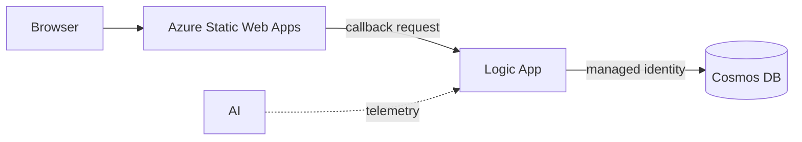

# Lab 1: CRUD integration

Build a small item-management website backed by a Logic App and Azure Cosmos
DB. The learner path connects the website directly to the workflow.

**Time:** 90 minutes

## Learning objectives

- Ground Copilot in an OpenAPI contract and repository instructions.
- Generate equivalent Bicep or Terraform in small, reviewable checkpoints.
- Grant Cosmos DB access through managed identity and least-privilege RBAC.
- Use Copilot to diagnose a deployment or request from exact tool output.

## Architecture



The workshop uses one HTTP-triggered Logic App with explicit operation handling.
[`contracts/openapi.yaml`](contracts/openapi.yaml) defines the operations and
response contract. The `items` Cosmos container uses `/id` as its partition
key.

The workflow is a private-networked Logic App Standard site and must follow
[`docs/logic-app-standard-baseline.md`](../../docs/logic-app-standard-baseline.md).
Its user-assigned identity accesses host storage; its system-assigned identity
accesses Cosmos DB.

The starter app sends one canonical request shape containing the OpenAPI
`operationId`, optional item ID, body, and correlation ID. The Logic App
switches on `operationId`.

The callback URL authorizes invocation and is visible to the browser for this
exercise. Do not commit, log, or share it; do not persist it in browser storage;
delete the workshop workflow afterward. The workflow must handle CORS preflight
and allow only the Static Web App origin.

## Target resource graph

Both IaC tracks must create behaviorally equivalent resources:

| Resource | Workshop requirement |
|---|---|
| Resource group | Lab-specific tags and chosen location |
| Cosmos DB account | Serverless capacity, local authentication disabled |
| SQL database/container | `workshop` / `items`, partition key `/id` |
| Virtual network | Reference four-subnet layout with delegated Logic App and private-endpoint subnets |
| Host storage | Keyless Standard_LRS account with blob, queue, table, and file private endpoints and private DNS |
| App Service plan | Windows WS1 Workflow Standard; cost-bearing |
| Logic App | Standard site with dual identities, VNet route-all, and HTTP request trigger |
| Cosmos RBAC | Logic App can read and write data only at the needed scope |
| Static Web App | Free SKU hosting the starter UI |
| Application Insights | Basic request and workflow observability |

Do not store a callback URL in Git, a Terraform output, or a Bicep output.
Retrieve it only for the current exercise and paste it into the starter UI.

## Choose a track

Use one track for implementation:

- **Bicep:** invoke
  [`.github/prompts/01-crud-bicep.prompt.md`](../../.github/prompts/01-crud-bicep.prompt.md)
  and work in `labs/01-crud-integration/iac/bicep/`.
- **Terraform:** invoke
  [`.github/prompts/01-crud-terraform.prompt.md`](../../.github/prompts/01-crud-terraform.prompt.md)
  and work in `labs/01-crud-integration/iac/terraform/`.

### Invoke the Terraform prompt

The prompt file is a reusable set of Copilot instructions, not a Terraform or
shell command. Start from the repository root so Copilot can load
`.github/copilot-instructions.md` and resolve every relative path in the
prompt.

**VS Code Copilot Chat**

1. Open this repository as the VS Code workspace.
2. Open Copilot Chat and select **Agent** mode.
3. Enter the prompt file name as a slash command:

   ```text
   /01-crud-terraform Work on Checkpoint 1 only. Stop after the pre-edit
   summary and wait for my approval.
   ```

4. Select the workspace prompt when it appears in autocomplete, then send the
   message.

**GitHub Copilot CLI**

1. In a terminal, change to the repository root and start Copilot:

   ```bash
   cd level-up-azure-integration-services
   copilot
   ```

2. At the interactive Copilot prompt, mention the file with `@`:

   ```text
   @.github/prompts/01-crud-terraform.prompt.md Follow this prompt. Work on
   Checkpoint 1 only. Stop after the pre-edit summary and wait for my approval.
   ```

   Typing `@` opens file autocomplete; select the Terraform prompt rather than
   entering the text as a shell command.

Copilot's first response should summarize the Checkpoint 1 resource graph,
identity flow, variables, non-secret outputs, and validation commands without
editing files. Check that it includes the mandatory Logic App Standard hosting
foundation and that `api_management_mode` defaults to `none`. Correct the
summary if necessary, then reply:

```text
Proceed with Checkpoint 1 only.
```

Review the proposed files before accepting edits. Checkpoint 1 must create only
the Terraform provider configuration, variables, naming, tags, and resource
group. It must not create the Logic App, storage, networking, Cosmos DB, or API
Management resources yet.

The same process works for Bicep by using `/01-crud-bicep` in VS Code or
mentioning `@.github/prompts/01-crud-bicep.prompt.md` in Copilot CLI. See
[Invoking workshop prompt files](../../docs/copilot-working-agreement.md#invoking-workshop-prompt-files)
for the reusable pattern.

Create your selected directory when Copilot begins the first checkpoint. Keep
local parameter values and Terraform state untracked.

## Checkpoint 1: contract and resource graph

1. Read the OpenAPI contract and inspect the starter app.
2. Ask Copilot to summarize every request, response, and required Azure
   resource. Correct its summary before allowing edits.
3. Ask Copilot to scaffold only providers/metadata, parameters or variables,
   naming, tags, and the resource group.
4. Validate without deploying.

**Bicep**

```bash
az bicep format --file labs/01-crud-integration/iac/bicep/main.bicep
az bicep build --file labs/01-crud-integration/iac/bicep/main.bicep
az deployment sub what-if \
  --location eastus2 \
  --template-file labs/01-crud-integration/iac/bicep/main.bicep \
  --parameters prefix="<your-prefix>" location="eastus2" \
   apiManagementMode="none"
```

**Terraform**

```bash
terraform -chdir=labs/01-crud-integration/iac/terraform init
terraform -chdir=labs/01-crud-integration/iac/terraform fmt -check
terraform -chdir=labs/01-crud-integration/iac/terraform validate
terraform -chdir=labs/01-crud-integration/iac/terraform plan \
  -var="prefix=<your-prefix>" -var="location=eastus2" \
  -var="api_management_mode=none"
```

**Checkpoint:** the preview contains one new resource group with no secrets in
parameters, variables, or outputs.

## Checkpoint 2: data and workflow

Ask Copilot to add only the reference Logic App Standard hosting foundation,
Cosmos DB, the workflow, identities, and RBAC.

Require it to explain:

- why `/id` works as both identifier and partition key for this lab;
- which Cosmos DB data-plane role is assigned and at what scope;
- how the workflow distinguishes list, get, create, update, and delete;
- how it maps not-found, validation, and unexpected errors to HTTP statuses;
- how retry behavior avoids accidentally repeating writes.

Deploy after the preview is understood:

```bash
# Bicep
az deployment sub create \
  --name "crud-<your-prefix>" \
  --location eastus2 \
  --template-file labs/01-crud-integration/iac/bicep/main.bicep \
  --parameters prefix="<your-prefix>" location="eastus2" \
    apiManagementMode="none"

# Terraform
terraform -chdir=labs/01-crud-integration/iac/terraform apply \
  -var="prefix=<your-prefix>" -var="location=eastus2" \
  -var="api_management_mode=none"
```

**Checkpoint:** Azure shows a system-assigned workflow identity and a Cosmos
data-plane role assignment. No account key appears in workflow parameters.

## Checkpoint 3: connect the frontend

Keep `apiManagementMode` or `api_management_mode` set to `none`. Ask Copilot to
add CORS preflight handling and restricted response headers to the workflow.
Retrieve the callback URL for the current session without writing it to a file,
repository output, or shell history. Use the Azure portal if your shell history
is retained.

In the starter UI choose **Direct Logic App** and paste the callback URL. The
app converts REST-style UI actions to the canonical backend request.

**Checkpoint:** create, list, get, update, and delete work directly, and the
callback URL is not persisted in browser local storage.

## Checkpoint 4: frontend and end-to-end test

Deploy the files under `app/` to Static Web Apps. In the UI, choose
**Direct Logic App** and paste the callback URL for this session. Never
hard-code it or save it in browser storage.

Create, list, get, update, and delete an item in the browser. Confirm each
result matches the OpenAPI contract, then inspect the correlated Logic App
telemetry.

## Copilot review challenge

Invoke
[`review-iac-parity.prompt.md`](../../.github/prompts/review-iac-parity.prompt.md)
with someone using the other track. Resolve behavioral differences, not cosmetic
syntax differences.

## Cleanup

Preview cleanup before approving it:

```bash
# Bicep-created resource group
az group delete --name "<resource-group-name>" --yes --no-wait

# Terraform
terraform -chdir=labs/01-crud-integration/iac/terraform destroy \
  -var="prefix=<your-prefix>" -var="location=eastus2" \
  -var="api_management_mode=none"
```

Confirm the workshop resource group is deleted before moving to another
subscription.

## Stretch goals

- Add optimistic concurrency using an ETag.
- Generate contract tests and run them in GitHub Actions.
- Compare the workshop design with the private-network patterns in the
  [reference project](https://github.com/scallighan/logic-app-doc-processing).
