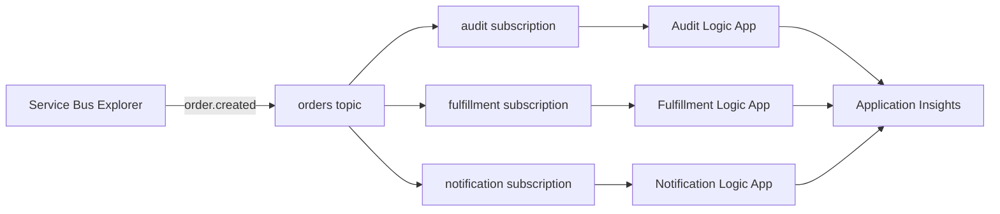

# Lab 2: Service Bus topic fan-out

Publish one `order.created` event to an Azure Service Bus topic and process an
independent copy in three Logic Apps: audit, fulfillment, and notification.

**Time:** 75 minutes

## Learning objectives

- Ground Copilot in an event schema and example rather than prose alone.
- Provision equivalent Service Bus and Logic App resources with Bicep or
  Terraform.
- Use topic subscriptions for independent delivery and failure isolation.
- Review generated workflows for locks, retries, completion, and dead lettering.
- Observe one correlation ID across multiple workflow runs.

## Architecture

Each workflow receives from exactly one subscription. A failure in notification
must not remove the audit or fulfillment copies.

## Event contract

Use:

- [`contracts/order-created.schema.json`](contracts/order-created.schema.json)
- [`contracts/sample-order-created.json`](contracts/sample-order-created.json)

Publish these Service Bus application properties with the sample:

| Property | Value |
|---|---|
| `eventType` | `order.created` |
| `schemaVersion` | `1.0` |
| `correlationId` | Same value as the JSON body |

## Target resource graph

| Resource | Workshop requirement |
|---|---|
| Resource group | Lab-specific tags and chosen location |
| Service Bus namespace | Standard SKU for topics |
| Topic | `orders`, duplicate detection enabled |
| Subscriptions | `audit`, `fulfillment`, and `notification` |
| Rules | SQL filter for `eventType = 'order.created'`; remove `$Default` |
| Logic Apps | Three independent stateful workflows |
| Workflow identities | System-assigned identities |
| Service Bus RBAC | Each receiver can access only what it needs |
| Application Insights | Correlated workflow telemetry |

Use peek-lock receive behavior. Complete a message only after the workflow's
processing scope succeeds. Let repeated failures reach the dead-letter queue;
do not silently discard a message.

## Choose a track

- **Bicep:** invoke
  [`.github/prompts/02-fanout-bicep.prompt.md`](../../.github/prompts/02-fanout-bicep.prompt.md)
  and work in `labs/02-topic-fanout/iac/bicep/`.
- **Terraform:** invoke
  [`.github/prompts/02-fanout-terraform.prompt.md`](../../.github/prompts/02-fanout-terraform.prompt.md)
  and work in `labs/02-topic-fanout/iac/terraform/`.

## Checkpoint 1: broker topology

Ask Copilot to scaffold the selected track and add only the namespace, topic,
subscriptions, and rules. Require a diagram or table of message routing before
allowing edits.

Important review questions:

- Does Standard SKU support every requested feature?
- Was the default true filter removed before adding a SQL filter?
- Is duplicate detection based on `MessageId`, and what is its time window?
- What are lock duration, delivery count, and message TTL?

Preview and deploy with the same native commands used in Lab 1, changing the
path, deployment name, and variables as appropriate.

**Checkpoint:** Service Bus Explorer shows the topic, exactly three
subscriptions, and the intended rule on each.

## Checkpoint 2: workflow identities and connections

Ask Copilot to add one Logic App per subscription, managed identity, minimum
receiver RBAC, and required Service Bus connections.

For each workflow, request an explicit try/catch-style design using Logic App
scopes:

1. Receive and lock the message.
2. Parse and validate the event.
3. Perform the workflow-specific action.
4. Complete the message only when the processing scope succeeds.
5. Abandon or dead-letter according to the documented failure policy.

The workshop actions can be lightweight:

- **Audit:** emit a structured telemetry record.
- **Fulfillment:** compose a fulfillment request and emit telemetry.
- **Notification:** compose a customer message and emit telemetry.

Do not add email, databases, or other paid dependencies during the core lab.

**Checkpoint:** each Logic App references only its assigned subscription and no
connection string appears in source, parameters, state output, or run history.

## Checkpoint 3: publish one event

In Azure Portal, open the `orders` topic and use **Service Bus Explorer** to send
the sample JSON. Set:

- `ContentType` to `application/json`;
- `MessageId` to the sample event ID;
- `CorrelationId` to the sample correlation ID; and
- the application properties from the contract table.

Before sending, ask Copilot to predict the message counts and workflow runs.
Then send exactly one event.

**Checkpoint:** all three workflows run once and preserve the same event ID and
correlation ID.

## Checkpoint 4: failure isolation

Temporarily make the notification processing scope fail before its complete
action. Send a new event with new IDs.

Observe:

- audit and fulfillment complete their copies;
- notification retries its own copy;
- delivery count increases only on the notification subscription; and
- the message reaches that subscription's dead-letter queue after the configured
  maximum deliveries.

Revert the deliberate failure. Ask Copilot to explain how a dead-letter replay
tool should preserve `MessageId`, correlation, and diagnostic context without
creating an infinite retry loop.

## Cross-track review

Pair with someone using the other IaC language and invoke
[`review-iac-parity.prompt.md`](../../.github/prompts/review-iac-parity.prompt.md).
Pay special attention to default rules, RBAC scope, lock handling, and resources
that cleanup could orphan.

## Cleanup

Use `az group delete` for a Bicep-created workshop resource group or
`terraform destroy` for Terraform. Preview the deletion first and confirm the
resource group disappears.

## Stretch goals

- Add a second event type and route it to only two subscriptions.
- Add a dead-letter monitor without automatically replaying poison messages.
- Use a session ID to preserve per-order processing order.
- Add a publisher Logic App fronted by API Management.
