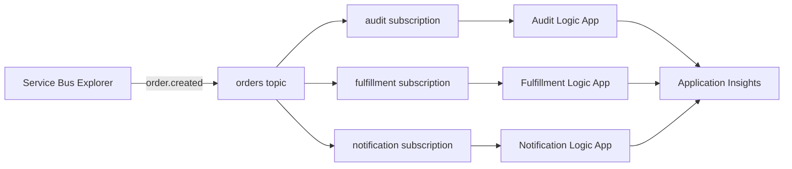

# Lab 2: Service Bus topic fan-out

Publish one `order.created` event to an Azure Service Bus topic and process an
independent copy in three Logic Apps: audit, fulfillment, and notification.

**Time:** 75 minutes

## Learning objectives

- Ground Copilot in an event schema and example rather than prose alone.
- Provision equivalent Service Bus and Logic App resources with Bicep or
  Terraform.
- Use topic subscriptions for independent delivery and failure isolation.
- Review generated workflows for locks, retries, completion, and dead lettering.
- Observe one correlation ID across multiple workflow runs.

## Architecture



Each workflow receives from exactly one subscription. A failure in notification
must not remove the audit or fulfillment copies.

All three workflows are separate private-networked Logic App Standard sites on
the shared hosting foundation defined in
[`docs/logic-app-standard-baseline.md`](../../docs/logic-app-standard-baseline.md).
They share the VNet, host storage, storage private endpoints, host-storage
identity, and WS1 plan, but keep separate system identities and Service Bus
authorization boundaries.

## Event contract

Use:

- [`contracts/order-created.schema.json`](contracts/order-created.schema.json)
- [`contracts/sample-order-created.json`](contracts/sample-order-created.json)

Publish these Service Bus application properties with the sample:

| Property | Value |
|---|---|
| `eventType` | `order.created` |
| `schemaVersion` | `1.0` |
| `correlationId` | Same value as the JSON body |

## Implementation reference

Read [`implementation-requirements.md`](implementation-requirements.md) before
starting. It defines the broker topology, shared Logic App hosting foundation,
identity boundaries, and message settlement behavior for both IaC tracks. The
task prompts below intentionally describe outcomes rather than repeat those
guardrails.

## Choose a track

- **Bicep:** invoke
  [`.github/prompts/02-fanout-bicep.prompt.md`](../../.github/prompts/02-fanout-bicep.prompt.md)
  and work in `labs/02-topic-fanout/iac/bicep/`.
- **Terraform:** invoke
  [`.github/prompts/02-fanout-terraform.prompt.md`](../../.github/prompts/02-fanout-terraform.prompt.md)
  and work in `labs/02-topic-fanout/iac/terraform/`.

The prompt file loads the selected track and mandatory references. Follow it
with the actual task request shown below; it does not infer what to build next.

## Task 1: build the broker topology

**Outcome:** create the Service Bus namespace, topic, subscriptions, and rules
without adding workflow infrastructure.

**Prompt Copilot**

```text
Create the Service Bus broker topology for Lab 2 in my selected IaC track. Add
only the resource group, namespace, orders topic, audit, fulfillment, and
notification subscriptions, and their rules. Do not add networking, storage,
Logic Apps, identities, RBAC, or Application Insights.

Before editing, provide a routing diagram or table and explain the SKU,
default-rule removal, SQL filters, duplicate detection, lock duration, maximum
delivery count, message TTL, expected files, and validation commands. Wait for
my approval.
```

**Review before approving:** confirm that Standard SKU supports the requested
features, duplicate detection uses `MessageId`, each `$Default` rule is removed,
and all delivery settings are deliberate.

**Validate:** preview and deploy with the same native commands used in Lab 1,
changing the path, deployment name, and variables as appropriate.

**Done when:** Service Bus Explorer shows the topic, exactly three
subscriptions, and the intended rule on each.

## Task 2: add isolated workflow receivers

**Outcome:** deploy the shared private hosting foundation and three independently
authorized workflow receivers.

**Prompt Copilot**

```text
Add the shared private Logic App Standard hosting foundation and one
independently deployable receiver for each Service Bus subscription. Include
managed identities, least-privilege receiver RBAC, required connections, and
correlated telemetry.

Before editing, explain the shared and per-workflow resource graph, identity and
RBAC boundaries, peek-lock flow, processing and failure scopes, completion and
dead-letter behavior, cost-bearing resources, expected files, and validation
commands. Wait for my approval.
```

**Review before approving:** each workflow must receive from exactly one
subscription, complete only after processing succeeds, and preserve retries and
dead lettering. Keep the audit, fulfillment, and notification actions within
the lightweight core-lab boundary.

**Done when:** each Logic App references only its assigned subscription and no
connection string appears in source, parameters, state output, or run history.

## Task 3: publish and trace one event

In Azure Portal, open the `orders` topic and use **Service Bus Explorer** to send
the sample JSON. Set:

- `ContentType` to `application/json`;
- `MessageId` to the sample event ID;
- `CorrelationId` to the sample correlation ID; and
- the application properties from the contract table.

**Prompt Copilot**

```text
Using the committed event schema and sample, predict the subscription message
counts and workflow runs after publishing exactly one order.created event.
Explain how MessageId, CorrelationId, eventType, and schemaVersion affect
routing, duplicate detection, and telemetry. Do not edit infrastructure.
```

Review the prediction, then send exactly one event.

**Done when:** all three workflows run once and preserve the same event ID and
correlation ID.

## Task 4: prove failure isolation

Temporarily make the notification processing scope fail before its complete
action. Send a new event with new IDs.

**Prompt Copilot**

```text
Create a controlled failure-isolation test for the notification workflow.
Describe the smallest temporary change, expected delivery-count progression,
retry and dead-letter behavior, evidence to collect from all three
subscriptions, and the exact revert. Do not weaken authentication, networking,
or message settlement.
```

Observe:

- audit and fulfillment complete their copies;
- notification retries its own copy;
- delivery count increases only on the notification subscription; and
- the message reaches that subscription's dead-letter queue after the configured
  maximum deliveries.

Revert the deliberate failure. Ask Copilot to explain how a dead-letter replay
tool should preserve `MessageId`, correlation, and diagnostic context without
creating an infinite retry loop.

**Done when:** audit and fulfillment complete independently, only notification
retries and dead-letters its copy, and the deliberate failure has been reverted.

## Cross-track review

Pair with someone using the other IaC language and invoke
[`review-iac-parity.prompt.md`](../../.github/prompts/review-iac-parity.prompt.md).
Pay special attention to default rules, RBAC scope, lock handling, and resources
that cleanup could orphan.

## Cleanup

Use `az group delete` for a Bicep-created workshop resource group or
`terraform destroy` for Terraform. Preview the deletion first and confirm the
resource group disappears.

## Stretch goals

- Add a second event type and route it to only two subscriptions.
- Add a dead-letter monitor without automatically replaying poison messages.
- Use a session ID to preserve per-order processing order.
- Add a publisher Logic App fronted by API Management.
