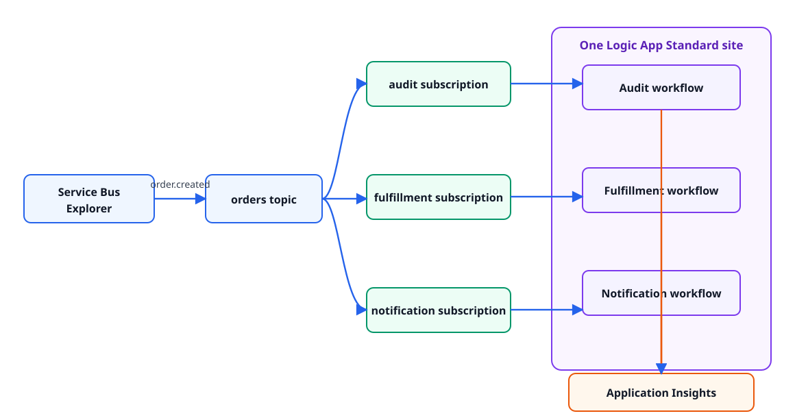

# Lab 2: Service Bus topic fan-out

Publish one `order.created` event to an Azure Service Bus topic and process an
independent copy in three workflows: audit, fulfillment, and notification.

**Time:** 75 minutes

## Learning objectives

- Ground Copilot in an event schema and example rather than prose alone.
- Provision equivalent Service Bus and Logic App resources with Bicep or
  Terraform.
- Use topic subscriptions for independent delivery and failure isolation.
- Review generated workflows for locks, retries, completion, and dead lettering.
- Observe one correlation ID across multiple workflow runs.

## Architecture



Each workflow receives from exactly one subscription. A failure in notification
must not remove the audit or fulfillment copies.

All three workflows run in one private-networked Logic App Standard site on the
hosting foundation defined in
[`docs/logic-app-standard-baseline.md`](../../docs/logic-app-standard-baseline.md).
Lab 2 can create the complete foundation and site or reuse the compatible
deployed Lab 1 foundation and site. The site's system identity receives access
at each subscription scope, never at namespace scope. The host-storage identity
remains limited to host storage.

## Event contract

Use:

- [`contracts/order-created.schema.json`](contracts/order-created.schema.json)
- [`contracts/sample-order-created.json`](contracts/sample-order-created.json)

Publish these Service Bus application properties with the sample:

| Property | Value |
|---|---|
| `eventType` | `order.created` |
| `schemaVersion` | `1.0` |
| `correlationId` | Same value as the JSON body |

## Implementation reference

Read [`implementation-requirements.md`](implementation-requirements.md) before
starting. It defines the broker topology, shared Logic App hosting foundation,
identity boundaries, and message settlement behavior for both IaC tracks. The
task prompts below intentionally describe outcomes rather than repeat those
guardrails.

## Choose a track

- **Bicep:** invoke
  [`.github/prompts/02-fanout-bicep.prompt.md`](../../.github/prompts/02-fanout-bicep.prompt.md)
  and work in `labs/02-topic-fanout/iac/bicep/`.
- **Terraform:** invoke
  [`.github/prompts/02-fanout-terraform.prompt.md`](../../.github/prompts/02-fanout-terraform.prompt.md)
  and work in `labs/02-topic-fanout/iac/terraform/`.

Invoke the selected prompt once from the repository root. It creates only the
initial file structure, minimal base files, and a path-local `AGENTS.md` with
the track's mandatory references and guardrails. It does not implement Step 0
or infer what to build next. Review the starter files, then use the bounded
prompt under Step 0.

## Step 0: resolve the shared hosting foundation

**Outcome:** explicitly select a new or existing private Logic App Standard
hosting foundation before creating Lab 2 integration resources.

Use `existing` when the compatible Lab 1 foundation is still deployed. Use
`new` when Lab 1 was skipped or cleaned up. Lab 2 always owns its resource
group; in existing mode it must not own or modify the referenced foundation.

**Prompt Copilot**

```text
Prepare the shared Logic App Standard hosting foundation for Lab 2 in my
selected IaC track. Require an explicit hosting foundation mode of new or
existing.

In new mode, create the Lab 2 resource group, complete private Logic App
Standard hosting and observability foundation, and one empty Standard site. In
existing mode, create the Lab 2 resource group and reference the compatible
deployed Lab 1 integration subnet, host storage, host-storage identity, WS1
plan, observability resources, and Standard site without taking ownership of
the parent site or foundation.

Do not add Service Bus, receiver RBAC, connections, or workflow definitions.

Before editing, explain both resource graphs, required mode-specific inputs,
compatibility checks, ownership and cleanup boundaries, cost-bearing resources,
non-secret outputs, expected files, and validation commands. Wait for my
approval.
```

**Review before approving:** mode selection must be explicit. New mode must
match the complete private Standard baseline. Existing mode must reject missing
references and must not import, retag, modify, replace, or delete Lab 1
foundation resources or the parent Logic App site. Lab 2 may later own child
workflows and subscription-scoped RBAC associated with that site. No storage
credential or observability connection string may be an output.

**Validate:** preview with the same native commands used in Lab 1, changing the
path, deployment name, variables, and hosting foundation mode as appropriate.
In existing mode, the preview contains only the Lab 2 resource group and
references to the existing site and foundation. In new mode, it also contains
the complete Lab 2-owned shared foundation and one empty Standard site.

**Done when:** the selected foundation is ready, its ownership is unambiguous,
and Lab 2 cleanup cannot remove reused Lab 1 resources.

## Task 1: deploy the integration infrastructure

**Outcome:** create the broker topology and authorize the selected Logic App
site without adding receiver workflow definitions.

**Prompt Copilot**

```text
Using the selected shared hosting foundation, create the Lab 2 integration
infrastructure in my selected IaC track. Add the Standard Service Bus
namespace, orders topic, audit, fulfillment, and notification subscriptions
and rules; managed-identity connection configuration for the selected Logic App
site; three receiver role assignments for its system identity, each scoped to
one subscription; and correlated observability.

Do not add audit, fulfillment, or notification workflow definitions.

Before editing, provide a routing diagram or table and explain the SKU,
default-rule removal, SQL filters, duplicate detection, lock duration, maximum
delivery count, message TTL, the site and workflow resource graph, the shared
system-identity tradeoff, RBAC scopes, expected files, non-secret outputs, and
validation commands.
Wait for my approval.
```

**Review before approving:** confirm that Standard SKU supports the requested
features, duplicate detection uses `MessageId`, each `$Default` rule is removed,
all delivery settings are deliberate, the site identity receives only at the
three subscription scopes rather than namespace scope, and no workflow
definition or connection string is present.

**Validate:** preview and deploy with the same native commands used in Lab 1,
changing the path, deployment name, and variables as appropriate.

**Done when:** Service Bus Explorer shows the topic, exactly three
subscriptions, and the intended rule on each; Azure shows three
subscription-scoped receiver assignments for the selected site identity.

## Task 2: implement isolated workflow receivers

**Outcome:** add only the three independently deployable receiver workflows to
the selected Logic App Standard site.

**Prompt Copilot**

```text
Add audit, fulfillment, and notification as three independently deployable
workflows in the selected Logic App Standard site. Each workflow must use the
site's managed-identity connection and receive from exactly one assigned
Service Bus subscription.

Do not create or replace the shared hosting foundation, Service Bus resources,
parent Logic App site, identity, RBAC, connections, or observability resources.

Before editing, explain the per-workflow resource and file changes, peek-lock
flow, processing and failure scopes, completion and dead-letter behavior,
correlation handling, and validation commands. Wait for my approval.
```

**Review before approving:** each workflow must receive from exactly one
subscription, complete only after processing succeeds, and preserve retries and
dead lettering. Keep the audit, fulfillment, and notification actions within
the lightweight core-lab boundary.

**Done when:** each workflow references only its assigned subscription and no
connection string appears in source, parameters, state output, or run history.

## Task 3: publish and trace one event

In Azure Portal, open the `orders` topic and use **Service Bus Explorer** to send
the sample JSON. Set:

- `ContentType` to `application/json`;
- `MessageId` to the sample event ID;
- `CorrelationId` to the sample correlation ID; and
- the application properties from the contract table.

**Prompt Copilot**

```text
Using the committed event schema and sample, predict the subscription message
counts and workflow runs after publishing exactly one order.created event.
Explain how MessageId, CorrelationId, eventType, and schemaVersion affect
routing, duplicate detection, and telemetry. Do not edit infrastructure.
```

Review the prediction, then send exactly one event.

**Done when:** all three workflows run once and preserve the same event ID and
correlation ID.

## Task 4: prove failure isolation

Temporarily make the notification processing scope fail before its complete
action. Send a new event with new IDs.

**Prompt Copilot**

```text
Create a controlled failure-isolation test for the notification workflow.
Describe the smallest temporary change, expected delivery-count progression,
retry and dead-letter behavior, evidence to collect from all three
subscriptions, and the exact revert. Do not weaken authentication, networking,
or message settlement.
```

Observe:

- audit and fulfillment complete their copies;
- notification retries its own copy;
- delivery count increases only on the notification subscription; and
- the message reaches that subscription's dead-letter queue after the configured
  maximum deliveries.

Revert the deliberate failure. Ask Copilot to explain how a dead-letter replay
tool should preserve `MessageId`, correlation, and diagnostic context without
creating an infinite retry loop.

**Done when:** audit and fulfillment complete independently, only notification
retries and dead-letters its copy, and the deliberate failure has been reverted.

## Cross-track review

Pair with someone using the other IaC language and invoke
[`review-iac-parity.prompt.md`](../../.github/prompts/review-iac-parity.prompt.md).
Pay special attention to default rules, RBAC scope, lock handling, and resources
that cleanup could orphan.

## Cleanup

Use `az group delete` for a Bicep-created workshop resource group or
`terraform destroy` for Terraform. Preview the deletion first and confirm the
Lab 2 resource group disappears. In existing hosting-foundation mode, confirm
the preview does not delete or modify any reused Lab 1 resource before
approving cleanup.

## Stretch goals

- Add a second event type and route it to only two subscriptions.
- Add a dead-letter monitor without automatically replaying poison messages.
- Use a session ID to preserve per-order processing order.
- Add a publisher Logic App fronted by API Management.
