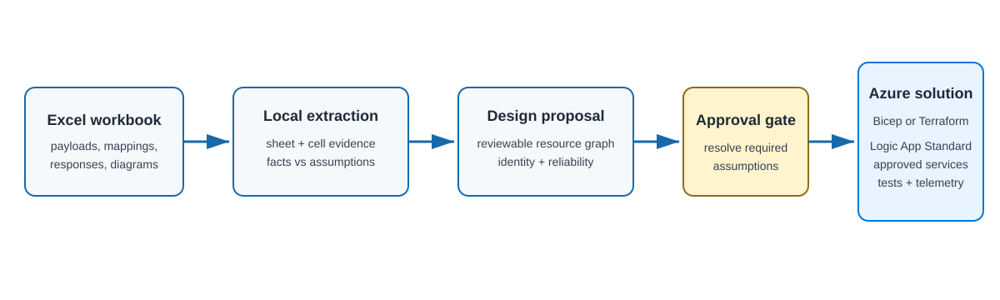

# Lab 3: Workbook to Azure integration solution

Turn an integration workbook containing sample payloads and transformation
logic into an evidence-backed Azure Integration Services design, then implement
the approved design with Bicep or Terraform.

**Time:** 90-150 minutes, depending on workbook complexity and target access

## Learning objectives

- Extract useful workbook evidence without uploading potentially sensitive data.
- Separate workbook facts from assumptions and unanswered design questions.
- Select Azure services from workload requirements rather than keywords.
- Convert a proposed design into a schema-valid, reviewable implementation
  contract.
- Translate and test transformation behavior before connecting live targets.
- Implement the approved resource graph with the same identity, networking,
  preview, and cleanup discipline used in Labs 1 and 2.

## Design-to-implementation loop



The workbook is design input, not executable infrastructure and not a complete
runtime contract. This lab uses
[`contracts/integration-design.schema.json`](contracts/integration-design.schema.json)
as the approval boundary. Azure implementation begins only after a learner
reviews the evidence and assumptions and changes the proposal status from
`proposed` to `approved`.

Workbook files are intentionally ignored by Git. Use local, sanitized copies
and never commit customer or production data.

## Implementation reference

Read [`implementation-requirements.md`](implementation-requirements.md) before
starting. It defines the evidence, approval, service-selection, identity,
transformation, reliability, and cleanup boundaries.

## How to read the workbook

Classify tabs and tables before proposing resources. Compare names
case-insensitively after trimming whitespace; keep the original names in
evidence references.

| Workbook element | Meaning in this lab |
|---|---|
| `Architect Diagram` or `Architecture Diagram` tab | Informational flow guidance: review arrows, branches, systems, and embedded images to establish how processing tabs connect. Do not create a workflow for this tab. |
| XRef tab or table entries | Reference data for transformation lookups, not a workflow or message source. Record keys, values, consuming tabs, and missing-key behavior. |
| Processing tab with a tab or table name beginning with `Source` | Starting point: create a workflow for the tab and a sample helper script that sends its sanitized Input example to its ingress queue. |
| Every other non-informational tab | One separate workflow in the Azure Logic App Standard app, including processing tabs for responses or files. Do not combine multiple tabs into one workflow. |
| Cells aligned under `Input` | Examples of the message that the tab's workflow receives. Derive a payload contract and sanitized input fixture; an example alone does not define all valid messages. |
| Cells aligned under `Transformation rule` | Mapping behavior used to create the Output, including defaults, conditionals, XRef lookups, and conversions. These are implementation guidance, not an executable Azure workflow. |
| Cells aligned under `Output` | Expected transformed message and output fixture, published to the next Service Bus topic for downstream consumption. |

Read column alignment using the actual headers and cell positions, including
merged headers; do not assume fixed column letters. Match each Input example
to its transformation rule and Output example. Review any other informational
tabs explicitly and record their purpose instead of silently discarding them.
An XRef table within a processing tab supplies lookup data without removing
that tab's workflow.

Use the architecture tab to establish the flow graph, then verify each arrow
against the upstream Output and downstream Input examples. Do not infer flow
order from tab position alone. Record missing links, conflicting examples,
unreadable images, and ambiguous classifications as questions to resolve before
approval.

### Suggested runtime architecture

For the simple workbook, the two processing tabs become two workflows:

```text
Source helper script (sanitized service-request Input)
  -> service-requests ingress queue
  -> Source workflow (service request -> canonical Output)
  -> canonical-requests topic
  -> maximo-transform subscription
  -> CBO-to-Maximo workflow (canonical Input -> Maximo Output)
  -> maximo-requests topic
  -> mock-target subscription (test consumer, then approved target adapter)
```

Service Bus carries every inter-tab message; do not replace a handoff with a
direct workflow call. Senders publish to a queue or topic, not directly to a
subscription. A downstream workflow receives from its own topic subscription.
For a diagram branch, use one subscription per downstream workflow so each
receives its own copy; document any routing properties and filters.

Architecture and XRef tabs do not add workflows. XRef data is a reviewed lookup
artifact used by the relevant transformation; a reference table alone does not
justify adding a database. The last processing tab still publishes its Output;
confirm who consumes it rather than inventing another workbook workflow.

Each Source helper accepts a namespace, ingress queue, and sanitized fixture,
uses Microsoft Entra authentication without connection strings, and sets
content type, message ID, and correlation ID. Document its dependencies,
sender-only access, network reachability, invocation, and expected result.
Create these scripts during workflow implementation, not during extraction or
proposal approval.

## Task 0: extract workbook evidence

**Outcome:** create a local text representation that Copilot and reviewers can
inspect while preserving sheet and cell references.

From the repository root, replace `sample.xlsx` with your local workbook path:

```bash
python scripts/extract-integration-workbook.py \
  sample.xlsx \
  --output /tmp/workbook-evidence.md
```

Use `--format json` for machine-readable output and
`--max-rows-per-sheet <count>` only for an initial review. The final proposal
must account for every relevant sheet. Inspect embedded workbook images
separately; the extractor lists but does not interpret them.

**Prompt Copilot**

```text
Read the extracted workbook evidence and the Lab 3 implementation requirements.
Create an evidence table that identifies source and target systems, triggers,
payload formats, transformations, validations, lookups, fan-out, responses, and
failure examples. Cite sheet names and exact cell references.

Apply the workbook interpretation rules: classify architecture and XRef
information separately, identify Source-prefixed starting points, and inventory
one workflow per non-informational tab. For each processing tab, link the Input,
Transformation rule, and Output cells. Use the reviewed architecture diagram
and matching payloads to identify inter-tab edges, not worksheet order. Record
image evidence by sheet and media reference; never invent a cell citation for
an image. The extractor does not classify tabs or interpret column alignment.

Separate facts from assumptions. List every question that must be answered
about protocols, authentication, volume, latency, ordering, idempotency,
recovery, ownership, networking, and sensitive data. Do not propose Azure
resources or edit files yet.
```

**Done when:** every material finding has cell evidence, embedded images have
been reviewed or marked unresolved, and unknowns are not presented as facts.

## Task 1: propose and approve the design

**Outcome:** create `labs/03-workbook-to-solution/design/integration-design.json`
as the reviewed implementation contract.

Use
[`contracts/sample-simple-design.json`](contracts/sample-simple-design.json) as
an example of structure and evidence depth, not as a design to copy.

**Prompt Copilot**

```text
Using the workbook evidence table and confirmed answers, propose the smallest
secure Azure Integration Services design that satisfies the flows.

Use one flows entry per processing tab. Record the original sheet name in each
entry's steps, its ingress queue or topic subscription in trigger, and its
output topic and downstream subscriptions in steps. Include Source helper
scripts, XRef lookup artifacts, and the diagram-derived routing graph. Keep
informational tabs out of flows and reconcile every downstream Input with the
preceding Output. Service Bus handoffs and separate tab workflows are required
for this lab; do not propose a single combined synchronous workflow.

Write labs/03-workbook-to-solution/design/integration-design.json so it
validates against contracts/integration-design.schema.json. Include workbook
cell evidence, remaining assumptions, flow steps, selected and optional Azure
resources, identity and RBAC scopes, private network paths, transformation
strategy, reliability, observability, security, cost-bearing resources,
implementation stages, validation, ownership, and cleanup boundaries.

Explain why each selected service is required and why plausible alternatives
were rejected. Keep status proposed. Do not initialize IaC or implement Azure
resources.
```

Validate JSON syntax:

```bash
jq empty labs/03-workbook-to-solution/design/integration-design.json
```

Validate against the schema with the JSON Schema tool available in your editor
or development environment. Review every assumption. Resolve all items marked
`mustConfirmBeforeImplementation`, then change `status` to `approved`.

**Done when:** the proposal is schema-valid, approved, bounded, cost-aware, and
specific enough that Bicep and Terraform learners would build equivalent
behavior.

## Choose an implementation track

After approval, invoke one starter prompt:

- **Bicep:** `.github/prompts/03-workbook-bicep.prompt.md`
- **Terraform:** `.github/prompts/03-workbook-terraform.prompt.md`

The prompt creates only the initial files and path-local instructions. It does
not infer or implement the proposal.

## Task 2: deploy the approved foundation

**Outcome:** deploy only the approved hosting, identity, network, and
observability foundation.

**Prompt Copilot**

```text
Read the approved Lab 3 integration design and implement only its foundation in
my selected IaC track. Include the Lab 3 resource group, required tags, complete
private Logic App Standard hosting baseline, empty Standard site, approved
observability, and only the private network resources required at this stage.

Do not add workload resources, connections, workflow definitions,
transformations, or external target configuration.

Before editing, explain the approved resource graph, identity boundaries,
ownership, cost-bearing resources, non-secret outputs, expected files, and
validation commands. Wait for my approval.
```

Use the same Bicep format/build/what-if or Terraform fmt/validate/plan sequence
as Labs 1 and 2.

## Task 3: deploy approved integration resources

**Outcome:** add only brokers, gateways, storage, Key Vault, private
connectivity, and workload RBAC explicitly selected by the approved proposal.

**Prompt Copilot**

```text
Implement only the approved Lab 3 integration resources and workload identity
assignments. Preserve the deployed Logic App hosting foundation and keep its
host-storage identity limited to host storage.

Do not add workflow definitions or external-system credentials.

Include the approved Source ingress queues, output topics, downstream
subscriptions and filters, and sender/receiver role scopes for each handoff.

Before editing, map each resource to the approved design evidence, explain
network and DNS paths, managed-identity scopes, retry or broker settings,
ownership, cost, expected preview, files, and validation commands. Wait for my
approval.
```

## Task 4: implement transformations and workflows

**Outcome:** implement the approved flows against mocks and sanitized fixtures.

**Prompt Copilot**

```text
Implement the approved Lab 3 transformations, connections, and Logic App
Standard workflows. Translate the workbook logic deliberately; do not claim a
mechanical DataWeave conversion.

Create one workflow per approved processing tab. Receive its Input from the
approved queue or subscription, apply its transformation rules and XRef
lookups, validate its Output, and publish that Output to the approved topic.
Complete the input message only after successful publication. Add a sample
helper script for each Source starting point to publish sanitized Input
fixtures to its ingress queue, with invocation and expected-result instructions.

Add sanitized source, canonical, target, response, and error fixtures and tests
for required fields, null/default behavior, conditionals, lookups, type and date
conversion, arrays, retries, target failures, and correlation. Connect only to
mocks unless the approved design records the real target protocol and
authentication method.

Do not recreate foundation or workload resources, broaden RBAC, add secrets, or
log complete payloads.

Before editing, explain the per-flow artifacts, transformation choices,
failure paths, expected files, and validation commands. Wait for my approval.
```

## Task 5: connect targets and prove failure behavior

Connect live targets only after their owners approve endpoint, authentication,
test-data, throttling, and recovery details. Use Key Vault references for
unavoidable external credentials.

Test the success path and every approved failure category. Confirm correlation
without exposing full payloads, then review the deployment and cleanup previews.

**Done when:** deployed behavior matches committed fixtures and contracts,
failures follow the approved reliability design, and cleanup targets only Lab
3-owned resources.

For every Source starting point, run its helper and trace the same correlation
ID through each tab workflow and broker handoff. Compare every emitted Output
with its fixture and verify fan-out copies, lookup failures, duplicate delivery,
failed publication, and dead-letter behavior.

## Cleanup

Preview deletion first. Delete the Lab 3 resource group for a Bicep-owned
deployment or run `terraform destroy`. Existing systems and shared Azure
resources referenced by the design must remain untouched.
